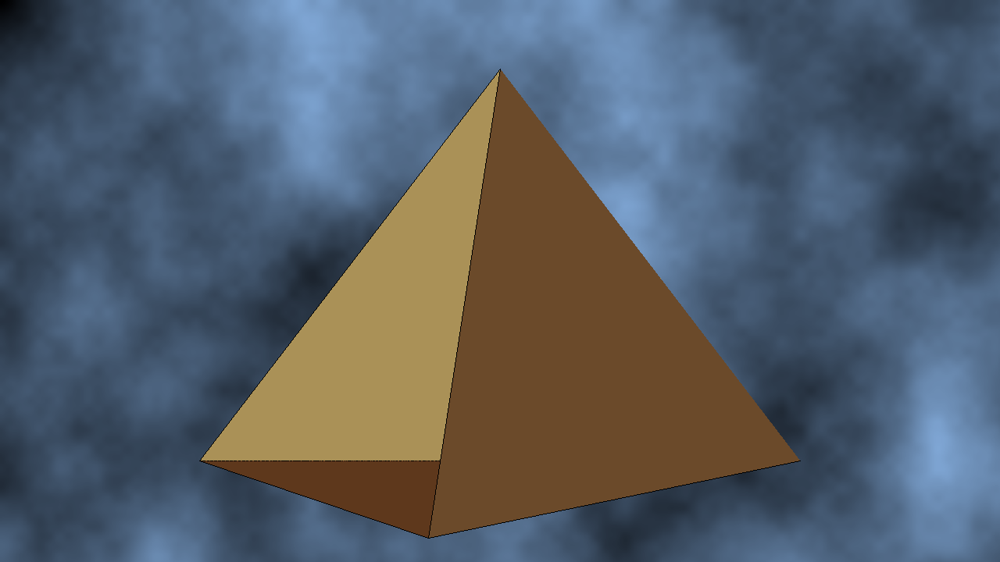

# Rasterbator (ik very funny)

Very primitive software rasterizer in C.

can draw lines and shi on a framebuffer!



2 python scripts included for converting the output `.ppm` to a more human `.png` and to delete output images.

## Build

```sh
make
```

duh

## Usage

```sh
./bin/raster
```

Ts (this) generates an `image.ppm`.
Convert it to a PNG using the script provided.
> [!TIP]
> Directly use ts if you don't hate yourself.
> ```sh
> make && ./bin/raster && py conv.py
> ```
