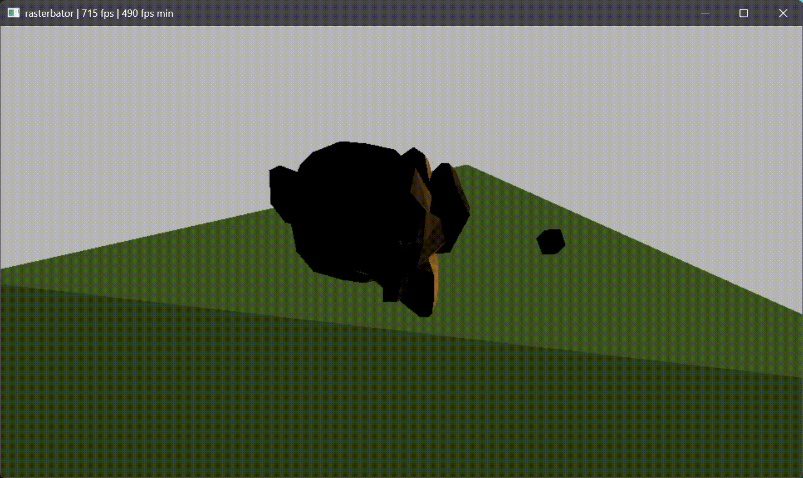

# Rasterbator (ik very funny)

A software rasterizer in C from scratch.

can draw 3D shi onto a 2D screen in real time!



## Build

> [!IMPORTANT]
> MSYS2 required on Windows.

Two platform layers are available: Win32 (default, no extra files!) and SDL3 (cross-platform, requires SDL3).

### Win32

```sh
make          # optimized
make debug    # debug symbols
```

### SDL

Requires SDL ofc. but you need to drop the files in manually:

1. Download the SDL3 libraries from the [SDL releases page](https://github.com/libsdl-org/SDL/releases)
2. Extract into `external/SDL3/`:

```
   external/SDL3/
   ├── include/
   │   └── SDL3/
   └── lib/
       └── ...
```

3. to build

```sh
make sdl
```

## Usage

```sh
./bin/raster
```

Ts (this) opens a window with real-time rendering.

> [!TIP]
> Directly use ts if you don't hate yourself.
>
> ```sh
> make && ./bin/raster
> ```
