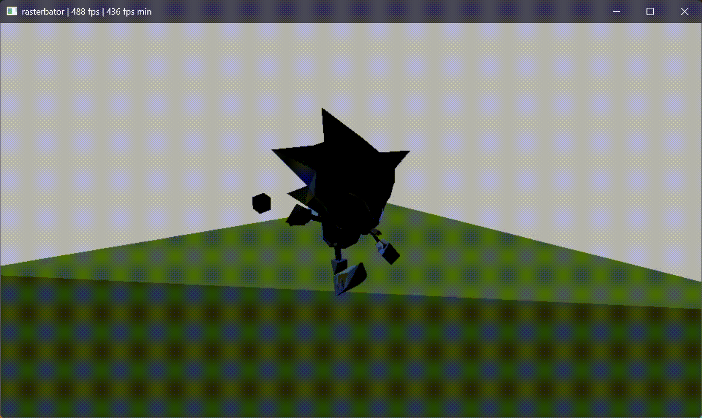
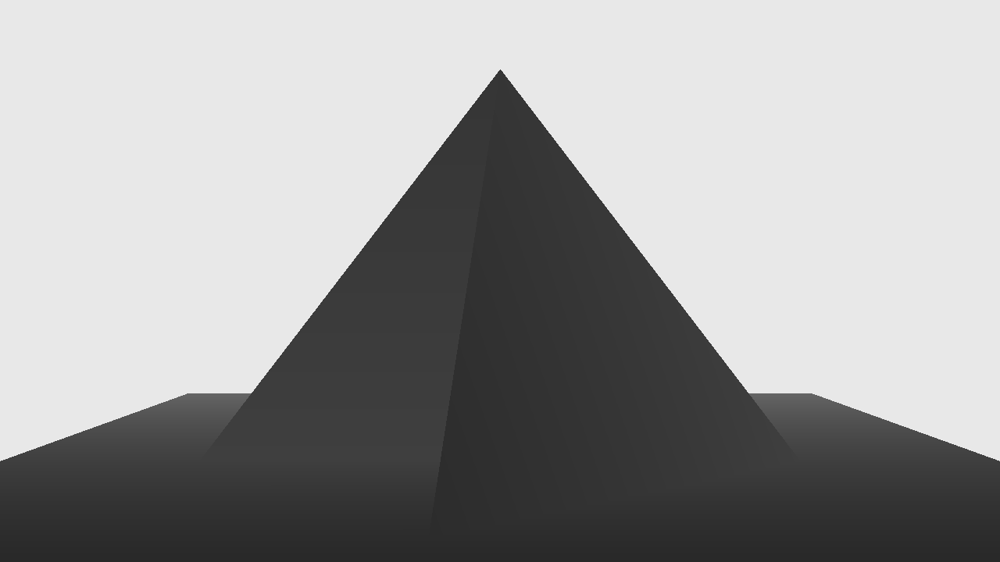

# Rasterbator (ik very funny)

> [!IMPORTANT]
> This build is Windows only. Build in MSYS2

Very primitive software rasterizer in C from scratch.

can draw 3D shi onto a 2D screen in real time!




The showcase video uses a Sonic the Hedgehog model (© SEGA) which is not included in this repo.

## Build

```sh
make
```
Builds the optimized `-O3` version.

```sh
make debug
```
Builds with `-O0` and debug symbols.

## Usage

```sh
./bin/raster
```

Ts (this) opens a Win32 window with real-time rendering.

> [!TIP]
> Directly use ts if you don't hate yourself.
> ```sh
> make && ./bin/raster
> ```

